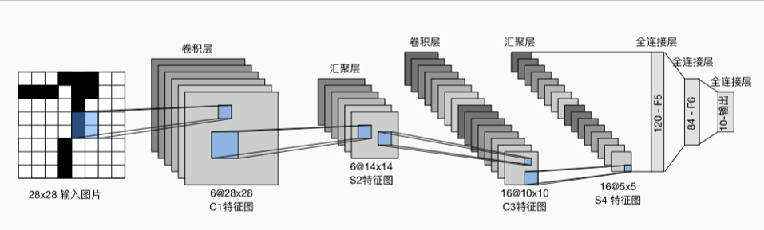

Example5
======================
  本例实现卷积和池化
  通过自己构建均方差损失函数和随机梯度下降来优化模型参数。
  
  数据集是pytorch官方提供的MINIST数据集，其中每张图片是1 * 28 * 28的灰度图。
我们的任务是要识别图片表示的是0至9的哪个数字。

  我们构建了如下图所示的LeNet，并使用之前的实现的接口进行训练。

  
  
  为了让读者更加熟悉深度神经网络的训练流程，本例特别将pytorch中的常用接口按照
  自己的方式实现并使用。但请注意，这并非pytorch的源码，甚至和源码有很大的出入，
  请不要误解。
  
  本例的重点在卷积和池化。
