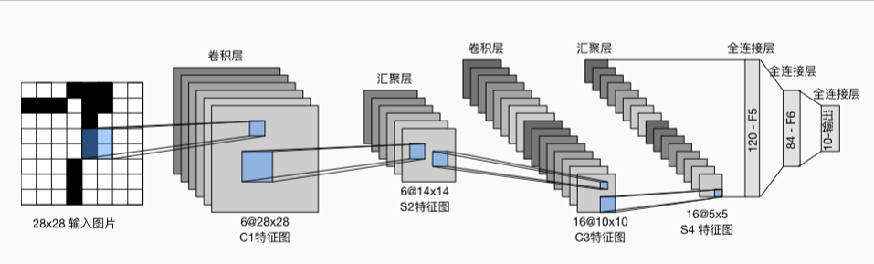

Example6
======================
  我们通过Pytorch的接口进行实战
  
  数据集是pytorch官方提供的MINIST数据集，其中每张图片是1 * 28 * 28的灰度图。
我们的任务是要识别图片表示的是0至9的哪个数字。

  我们构建了如下图所示的LeNet。

  

  将模型参数保存到当前目录中，并命名为weight.pt，
  将tensorboard绘图存到logs/exp1中

  NN.py内的CNN是我们自定义的神经网络类,
  main.py负责训练并评估模型，
  detect.py将导入训练好并保存了的模型，并从MNIST测试集中随机抽取一张图片来做预测
